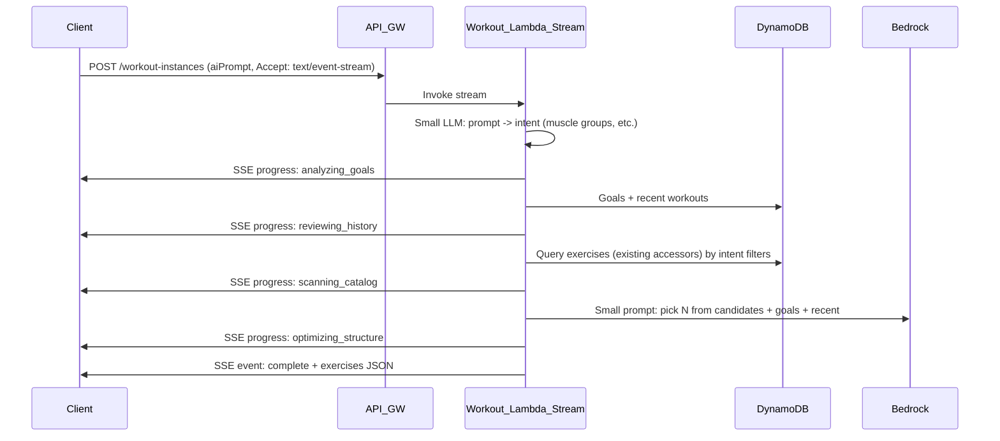

# AI Workout Generation: Multi-Step + SSE Plan

## Problem

- Single-shot AI Lambda sends a large prompt (full catalog + goals + recent workouts) to Bedrock. Nova Micro’s context and/or timeout cause silent failure (no error logged after "invoking Bedrock Converse").
- Frontend gets "Internal Server Error" with no progress UI; experience does not match the prototype’s step-by-step checklist.

## Design Decisions (confirmed)

| Question | Decision |
|----------|----------|
| **Streaming** | Use SSE from the get-go; no sync fallback. |
| **Regenerate** | In scope. Simple: same muscle group only — pre-filter by muscle group, then small model to pick a **different** exercise for that slot (not full workout regeneration). |
| **Route** | Use the **same route**: `POST /workout-instances`. When body includes `aiPrompt`, the response is SSE (streaming). When body includes `exercises[]`, the response is JSON (create workout). No new route. Frontend may need updates if the response model changes. |
| **Prompt interpretation** | Step 1 is a **small LLM call** to determine initial filtering (e.g. muscle groups, duration hint, push/pull/legs/full). |
| **Catalog search** | Use **existing accessors** to fetch data (same DynamoDB queries / logic as exercise API, e.g. by `muscleGroup`, `search` — no new endpoints). |

---

## Target Architecture



---

## Multi-Step AI Flow (no single huge prompt)

| Step | Action | Emit SSE |
|------|--------|----------|
| 1 | **Small LLM call:** "Given this user request, return JSON: { muscleGroups?: string[], durationHint?: string, focus?: 'push' \| 'pull' \| 'legs' \| 'full' }." Use result for filtering. | `analyzing_goals` |
| 2 | Load user goals + recent workouts from DynamoDB (compact). | `reviewing_history` |
| 3 | **Catalog search** via existing accessors: query exercises by `muscleGroup`(s) and/or search from step 1 → e.g. 20–50 candidates. | `scanning_catalog` |
| 4 | Build **small** prompt: "From these N exercises (id, name, muscleGroup, modality, defaultSets/Reps), pick 5–8 for: [user prompt]. Goals: [compact]. Recent: [compact]. Return JSON array only." | - |
| 5 | Single Bedrock call (Nova Micro) with ~2K–6K chars max. | `balancing_muscles` / `optimizing_structure` |
| 6 | Parse JSON, validate exerciseIds against catalog, return. | `complete` + exercises |

Catalog is never fully in the prompt; only the **candidate subset** from step 3 is sent.

---

## Regenerate (single exercise, same muscle group)

- **Trigger:** User on review screen selects one (or more) exercises and clicks "Regenerate" (e.g. per exercise or "Regenerate selected").
- **Backend:** Same route `POST /workout-instances` with body e.g. `{ aiPrompt, regenerateContext: { exerciseIndices: number[], currentExerciseIds: string[], muscleGroup: string } }`. When `regenerateContext` is present:
  - Skip step 1 (intent) or reuse muscle group from context.
  - **Pre-filter catalog** by `muscleGroup` (existing accessor).
  - Exclude `currentExerciseIds` from candidates (so we pick a **different** exercise).
  - Small LLM: "Pick one exercise from this list to replace the current one, same muscle group. Return single JSON object."
  - Emit SSE progress (fewer steps is fine), then `complete` with the **updated** exercise list (replacement applied server-side or returned as patch for frontend to merge).
- **Frontend:** Call same SSE endpoint with `regenerateContext`; on `complete`, merge new exercise(s) into draft and stay on review.

---

## Same Route, Two Behaviors

- **`POST /workout-instances`**
  - **Body has `exercises[]` (and no `aiPrompt`):** Create workout as today. Response: JSON `201` with workout object.
  - **Body has `aiPrompt`:** Start AI generation. Response: **streaming** (`Content-Type: text/event-stream`). Client must send `Accept: text/event-stream` and parse SSE. Optional `regenerateContext` for regenerate flow.

Implementation implication: the **Workout Lambda** (or a single Lambda behind this route) must support **response streaming** when handling `aiPrompt`. So this Lambda is configured with `InvokeMode.RESPONSE_STREAM` and uses Node `streamifyResponse()`. For non-AI requests (body with `exercises[]`), the same Lambda returns a normal JSON response (no stream). API Gateway must support streaming for this integration (REST API with stream transfer mode or Lambda Function URL; HTTP API streaming support to be verified).

---

## SSE Event Sequence (unchanged from backend-spec Phase 12)

```
event: progress
data: {"step": "analyzing_goals", "message": "Analyzing your fitness goals..."}

event: progress
data: {"step": "reviewing_history", "message": "Reviewing your recent workouts..."}

event: progress
data: {"step": "scanning_catalog", "message": "Scanning exercise catalog..."}

event: progress
data: {"step": "balancing_muscles", "message": "Balancing muscle groups..."}

event: progress
data: {"step": "optimizing_structure", "message": "Optimizing workout structure..."}

event: complete
data: {"exercises": [ ... WorkoutExercise[] ... ]}
```

On error:

```
event: error
data: {"message": "..."}
```

---

## Backend Changes (summary)

- **Workout Lambda** becomes the stream handler when `aiPrompt` is present:
  - Use **streamifyResponse()** for the handler (or a dedicated sub-handler that is invoked when request has `aiPrompt` and `Accept: text/event-stream`).
  - Steps 1–6 above; step 1 = small LLM for intent; step 3 = use existing catalog accessors (DDB/query used by exercise API).
  - Write SSE to the response stream after each step; on success send `complete` with exercises; on error send `error` and log.
- **Regenerate:** Same handler, detect `regenerateContext`; pre-filter by muscle group, exclude current exercise IDs, small LLM to pick replacement(s); emit progress and `complete` with updated list or patch.
- **CDK:** Configure this Lambda with `invokeMode: RESPONSE_STREAM`. Wire API Gateway to stream the response (same route `POST /workout-instances`).
- **Catalog access:** Reuse existing accessors (e.g. shared `queryExercises` or DDB query by `muscleGroup` / index) — no new HTTP call to exercise Lambda required; Lambda can use shared layer or direct DDB.

---

## Frontend Changes (summary)

- **API:** Add `streamWorkoutGeneration(prompt, onProgress, onComplete, onError)` and optionally `streamWorkoutRegenerate(regenerateContext, onProgress, onComplete, onError)` using `fetch` with `Accept: text/event-stream`, POST body `{ aiPrompt, regenerateContext? }`, parse SSE from `response.body` (ReadableStream).
- **AI flow:** From AI Workout screen, on "Generate" → call stream API → show **progress checklist** (Analyzing goals…, Scanning catalog…, etc.) → on `complete` put exercises in draft and navigate to Review.
- **Regenerate:** On review screen, "Regenerate" for selected exercise(s) → call stream API with `regenerateContext` → on `complete` merge result into draft and stay on review.
- **Backward compatibility:** Not required; if the response model for SSE or JSON changes, update the frontend accordingly.

---

## Files to Touch (implementation)

| Area | Files |
|------|--------|
| Backend – stream + multi-step | `packages/lambdas/workout/src/index.ts` (or split: stream handler in `ai` package that workout invokes, or single Lambda with streamifyResponse and branching on body). Intent LLM + catalog query + main selection LLM; SSE writes. |
| Backend – catalog access | Reuse `packages/lambdas/exercise/src/query.ts` (e.g. import in AI/workout Lambda) or shared DDB queries; no new route. |
| Backend – CDK | `packages/cdk/lib/repwise-stack.ts`: Workout Lambda `invokeMode: RESPONSE_STREAM`; API integration supports stream. |
| Frontend – API | `packages/web/src/api/workouts.ts` or `ai.ts`: `streamWorkoutGeneration`, optional `streamWorkoutRegenerate`. |
| Frontend – UI | `AIWorkoutScreen`: use stream API, show progress checklist. Review screen: Regenerate button(s) + call stream with `regenerateContext`. |
| Spec | This file: `specs/ai-workout-sse-plan.md`. |

---

## References

- [Backend spec Phase 12 — AI Lambda (SSE)](backend-spec.md)
- [Frontend spec 2c — SSE Client for AI Workout Generation](frontend-spec.md)
- Prototype: [CreateWorkoutPage](prototype-app/src/pages/CreateWorkoutPage.tsx) — `AI_PROGRESS_STEPS`, `renderAIGenerating`, regenerate selection + `generateAIWorkout(regenerateIndices)`.
