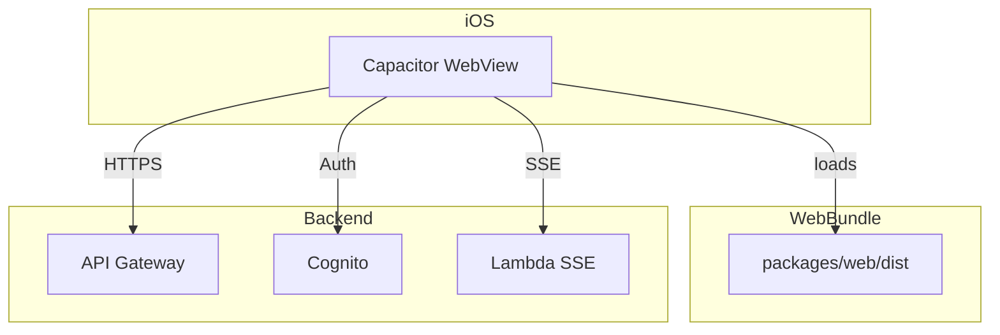

# Capacitor iOS App Plan

## Problem / Goal

- Repwise currently runs as a web app (React, Vite) deployed to S3 + CloudFront. Users access it via browser or PWA.
- **Goal:** Run the same app natively on iPhone as an iOS app, without duplicating frontend code. Capacitor wraps the built web assets in a native WebView container.

---

## Why Capacitor

| Consideration | Decision |
|---------------|----------|
| **No duplication** | Single React codebase. Build once with Vite; Capacitor serves `dist/` inside a native WebView. |
| **Native shell** | App Store distribution, splash screen, status bar control, native navigation gestures. |
| **Plugin ecosystem** | Access to device APIs (camera, haptics, etc.) if needed later. |
| **Alternatives** | React Native (full rewrite); PWA-only (limited App Store presence, no native feel). Capacitor avoids both. |

---

## Current Frontend Context

| Item | Detail |
|------|--------|
| **Location** | [packages/web/](../packages/web/) |
| **Build output** | `packages/web/dist` (Vite default) |
| **Router** | React Router `BrowserRouter` — works in Capacitor; app is served with a proper origin. |
| **Auth** | AWS Amplify (Cognito) — custom UI (`LoginDialog`), username/password (no Hosted UI). Runs in WebView without redirect URIs. |
| **Env config** | `VITE_COGNITO_USER_POOL_ID`, `VITE_COGNITO_CLIENT_ID`, `VITE_API_BASE_URL`, `VITE_AI_WORKOUT_STREAM_URL` |
| **PWA readiness** | `manifest.json`, `viewport-fit=cover`, `apple-mobile-web-app-*` meta tags in [packages/web/index.html](../packages/web/index.html) |

---

## Architecture



- Capacitor bundles `dist/` into the iOS app. At runtime, the WebView loads the app; all API calls go over the network to the deployed backend (same as web).
- No backend changes; iOS app uses the same API, Cognito user pool, and AI stream URL.

---

## Implementation Phases

### Phase 1: Add Capacitor to packages/web

1. Install Capacitor (core, CLI, and iOS platform):

   ```bash
   pnpm --filter web add @capacitor/core @capacitor/cli @capacitor/ios
   ```

2. Initialize Capacitor (from `packages/web`):

   ```bash
   cd packages/web && npx cap init
   ```

   Use app name `Repwise` and app ID `com.repwise.app` (or your chosen bundle ID).

3. Create [packages/web/capacitor.config.ts](../packages/web/capacitor.config.ts):

   ```ts
   import type { CapacitorConfig } from '@capacitor/cli';

   const config: CapacitorConfig = {
     appId: 'com.repwise.app',
     appName: 'Repwise',
     webDir: 'dist',
     server: {
       // Optional: for live-reload during dev with `npx cap run ios --livereload --external`
       // url: 'http://<your-machine-ip>:5173',
       // cleartext: true
     },
   };
   export default config;
   ```

4. Add scripts to [packages/web/package.json](../packages/web/package.json):

   ```json
   "cap:add:ios": "cap add ios",
   "cap:sync": "cap sync ios",
   "cap:open:ios": "cap open ios",
   "cap:run:ios": "cap run ios"
   ```

---

### Phase 2: Add iOS platform

1. Build the web app, then add iOS:

   ```bash
   pnpm --filter web build
   pnpm --filter web cap:add:ios
   ```

2. This creates `packages/web/ios/` with the Xcode project.

3. Git: Commit `ios/` for local builds, or add to `.gitignore` and build from CI. Common practice is to commit so developers can open Xcode directly.

4. Ensure `ios/App/App/public` is populated by `cap sync` (Capacitor copies `dist/` here).

---

### Phase 3: Build and run flow

| Step | Command | Purpose |
|------|---------|---------|
| 1 | `pnpm --filter web build` | Produce `packages/web/dist` |
| 2 | `pnpm --filter web cap:sync` | Copy `dist/` into iOS project |
| 3 | `pnpm --filter web cap:open:ios` | Open Xcode (or `cap:run:ios` for Simulator) |
| 4 | Run from Xcode or Simulator | Test the app |

Optional convenience script at repo root:

```json
"build:ios": "pnpm --filter web build && pnpm --filter web cap:sync"
```

---

### Phase 4: Environment configuration for iOS

- iOS build needs the same env vars as production web.

**Recommended:** Use `.env.production` (or `.env.ios`) when building for iOS. Ensure it contains:

- `VITE_COGNITO_USER_POOL_ID`
- `VITE_COGNITO_CLIENT_ID`
- `VITE_API_BASE_URL`
- `VITE_AI_WORKOUT_STREAM_URL`

Values should match the deployed stack outputs (see [DEPLOYMENT.md](../DEPLOYMENT.md)).

Add [packages/web/.env.ios.example](../packages/web/.env.ios.example) (or extend `.env.example`) with placeholders and document that these must match the deployed backend.

Build command for iOS (from `packages/web`):

```bash
# Copy and fill .env.ios, then:
pnpm build --mode production  # or --mode ios if you add that mode
```

---

### Phase 5: iOS-specific tweaks (optional)

| Area | Recommendation |
|------|----------------|
| **Safe area** | `viewport-fit=cover` and `env(safe-area-inset-*)` in CSS — may already be sufficient; verify notch/home indicator. |
| **Status bar** | Capacitor [Status Bar](https://capacitorjs.com/docs/apis/status-bar) plugin — optional. |
| **Splash screen** | Capacitor [Splash Screen](https://capacitorjs.com/docs/apis/splash-screen) plugin — optional for polish. |
| **Cognito** | Username/password flow in WebView should work as-is. If Cognito blocks non-browser origins, add `capacitor://localhost` to Cognito User Pool app client "Allowed callback URLs" — note as troubleshooting step. |

---

### Phase 6: CDK / deployment

- No CDK changes required. The iOS app consumes the existing deployed API, Cognito, and AI Lambda.
- Optional: Add a "Build & run iOS" section to [DEPLOYMENT.md](../DEPLOYMENT.md) that links to this spec.

---

## File Changes Summary

| File | Change |
|------|--------|
| `packages/web/package.json` | Add Capacitor deps (`@capacitor/core`, `@capacitor/cli`, `@capacitor/ios`), scripts (`cap:add:ios`, `cap:sync`, `cap:open:ios`, `cap:run:ios`) |
| `packages/web/capacitor.config.ts` | New — Capacitor config (appId, appName, webDir, optional server) |
| `packages/web/ios/` | New — from `npx cap add ios` (Xcode project) |
| `packages/web/.env.ios.example` | New — optional; documents VITE_* vars for iOS build |
| `.gitignore` | Optionally adjust for `ios/` if not committing native project |
| `DEPLOYMENT.md` | Add short "iOS build & run" section linking to this spec |

---

## Prerequisites

- macOS with Xcode (for iOS Simulator or device)
- Apple Developer account (for device testing / App Store)
- Node 20.x, pnpm — same as web

---

## Verification

- [ ] `pnpm --filter web build` produces `dist/` with no errors
- [ ] `npx cap sync ios` copies assets into `ios/App/App/public`
- [ ] `npx cap run ios` launches app in Simulator; login and core flows work
- [ ] API calls and SSE (AI workout) work against deployed backend

---

## Out of Scope (for this spec)

- App Store submission process, screenshots, metadata
- Android (Capacitor supports it; separate spec if desired)
- Code signing and provisioning (covered by Xcode docs)
