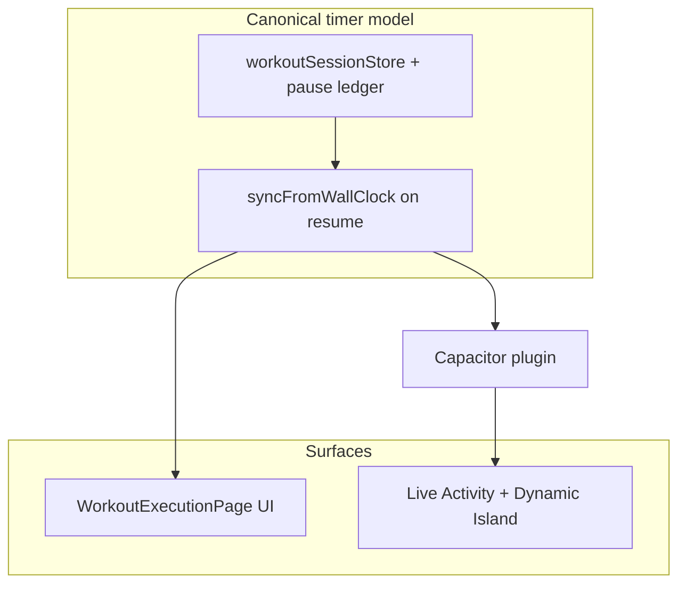

# Workout Timer, Live Activity & Dynamic Island

## Goal

Deliver **one integrated feature**: workout time stays accurate when the app is backgrounded or the WebView is suspended, **and** the user always sees a **Live Activity** on the **Lock Screen** and **Dynamic Island** (where supported) that matches what [WorkoutExecutionPage.tsx](../packages/web/src/features/workoutExecution/WorkoutExecutionPage.tsx) shows—session elapsed, current exercise, and weight (or duration context).

This is **not** an optional native polish layer: **ActivityKit** (Live Activities) is **required** for active workout sessions on iOS builds. The in-app timer fix and the system surface are **the same milestone**: they share a **canonical timer model** and the same **update moments**.

The React app runs inside Capacitor; **lock screen and Dynamic Island UI require native iOS code** (ActivityKit + Widget Extension), not CSS or React alone.

**Related:** Execution UX on the same screen is covered in [app-cleanup-feedback.md](./app-cleanup-feedback.md) (modals, weight controls, etc.).

---

## Constraints & non-goals

| Topic | Notes |
|-------|--------|
| **iOS version** | **16.1+** for Live Activities (ActivityKit). |
| **Dynamic Island** | Hardware-dependent (e.g. iPhone 14 Pro and later). Older devices still get **compact** Live Activity on Lock Screen / banner. |
| **App Store** | Live Activities must be timely, relevant, and tied to user-initiated workout sessions. |
| **Battery / updates** | Throttle native `update` calls if needed; prefer ActivityKit **date-driven** timers where possible (see Step 6). |
| **Android / web** | This spec targets **iOS native shell**; other platforms may use different patterns later. |

---

## Current State

| Component | Behavior | Problem |
|-----------|----------|---------|
| **Session elapsed** | [workoutSessionStore.ts](../packages/web/src/stores/workoutSessionStore.ts) — `startedAt`, `elapsedSeconds`, `tickElapsed` via `setInterval` in [WorkoutExecutionPage.tsx](../packages/web/src/features/workoutExecution/WorkoutExecutionPage.tsx) | Timers stall in background; elapsed drifts behind wall clock |
| **Pause** | `isPaused` + `pauseSession` / `resumeSession` | Need wall-clock math to exclude paused intervals |
| **Duration exercise timer** | Local React state `durationElapsed`, `durationRunning` in `WorkoutExecutionPage` | Lost on remount; does not survive process kill |
| **Live Activity / Dynamic Island** | Not implemented | WebView cannot render on lock screen; requires ActivityKit + Widget Extension |

---

## Unified architecture

**Canonical state** (timestamps, pause ledger, per-exercise duration anchors) lives in the session store (and optionally a small shared helper module). **After every sync**, derived values feed:

1. **React** — header timer, duration card, etc.
2. **Capacitor plugin** — `updateWorkoutActivity` so Lock Screen / Dynamic Island stay aligned.

**Wall-clock sync** (`document.visibilitychange`, Capacitor `App` `appStateChange`) recomputes elapsed / remaining; the **same** code path should refresh the Live Activity so backgrounding never desynchronizes app vs system UI.

ActivityKit can use **date-driven** presentation (e.g. countdown via `endDate` or `Text(timerInterval:)`) so the lock screen timer animates smoothly **without** per-second JavaScript—**complementing** the web timer rather than duplicating logic as a separate product.

**Lifecycle (conceptual):**

- **Start activity** when the workout session starts (`startSession` / navigation to execute).
- **Update** on pause, resume, exercise change, weight change, and duration-segment changes (throttle if needed).
- **End** on complete or cancel.

---

## Sequenced implementation

Work proceeds in **one ordered sequence**—not a “web MVP” followed by an optional native add-on.

| Step | Focus | Rationale |
|------|--------|------------|
| **1** | **Session store** — Pause ledger (`pausedAt` / `totalPausedMs` or equivalent), helpers to derive `elapsedSeconds` and duration-segment remaining from wall clock | Trustworthy in-app UI and stable payloads for native |
| **2** | **Sync hooks** — `syncElapsedFromClock` on `visibilitychange` and app resume; persist duration progress in the session store (not ephemeral React state) | Fixes WKWebView when backgrounded; **same hook** should trigger or schedule native refresh |
| **3** | **Plugin contract** — TypeScript API: `startWorkoutActivity`, `updateWorkoutActivity`, `endWorkoutActivity` with a payload aligned to the canonical model (e.g. `exerciseName`, `sessionElapsedSeconds`, `durationEndDate` or `remainingSeconds`, `weight`, `weightUnit`, `isPaused`) | Stable contract before Swift work; no-op on web |
| **4** | **Xcode** — Widget Extension target, `ActivityAttributes` + `ContentState`, start on workout start, end on complete/cancel | Mandatory Lock Screen + Dynamic Island (where supported) |
| **5** | **Wire lifecycle** — After any store mutation that affects time or context (pause, resume, next/prev exercise, weight change, duration events), update store then call **updateWorkoutActivity** (debounce/throttle if needed) | Single source of truth across surfaces |
| **6** | **Native timer UX** — Prefer ActivityKit APIs that bind to **absolute time** for duration countdowns; document strategy for **session** elapsed (event-driven vs periodic updates) to balance accuracy and battery | Smooth lock screen without per-second JS |
| **7** | **QA** — Matrix: background 30–60s, kill/reopen, lock screen, device with Dynamic Island, device with Live Activity only | Acceptance criteria |

---

## Implementation checklist

Ordered to match the sequence above.

- [x] **1** — Session store: pause ledger + helpers for wall-clock `elapsedSeconds` and duration segment state
- [x] **2** — `syncFromWallClock` + visibility / `App` listeners; duration state in persisted store; `WorkoutExecutionPage` uses store only
- [x] **3** — Capacitor plugin (TS + web stub + iOS): `startWorkoutActivity` / `updateWorkoutActivity` / `endWorkoutActivity` + shared payload type (`packages/capacitor-workout-live-activity`)
- [x] **4** — iOS: Widget extension, ActivityKit attributes & views; start/end from plugin
- [x] **5** — Wire plugin from execution lifecycle (throttled updates + interval)
- [x] **6** — Native: `durationEndDate` in payload; session elapsed via periodic plugin updates (throttle ~2s)
- [ ] **7** — QA matrix on simulator and physical devices (including DI and non-DI)

---

## Files (likely)

| Area | Path | Role |
|------|------|------|
| Store | [packages/web/src/stores/workoutSessionStore.ts](../packages/web/src/stores/workoutSessionStore.ts) | Pause ledger, duration fields, `syncElapsedFromClock` |
| Execution | [packages/web/src/features/workoutExecution/WorkoutExecutionPage.tsx](../packages/web/src/features/workoutExecution/WorkoutExecutionPage.tsx) | Listeners, store-only duration state, plugin calls |
| App / Capacitor | [packages/web/src/main.tsx](../packages/web/src/main.tsx) or dedicated hook | `App.addListener('resume', …)` alongside `visibilitychange` |
| Plugin | `packages/web` + new local Capacitor plugin package or `ios/` native target | JS facade + Swift bridge |
| iOS | `packages/web/ios/` — app + **Widget Extension** | ActivityKit UI, entitlements |
| Config | [capacitor.config.ts](../packages/web/capacitor.config.ts) | Register plugin if required |

---

## Engineering notes (indicative)

1. **Xcode:** Add Widget Extension; implement `ActivityConfiguration` / `ActivityAttributes` + `ContentState`.
2. **Push Notifications** capability: only if using **push** to update activities (often **not** required for local `Activity.update`).
3. **Minimum iOS:** **16.1+** for Live Activities; Dynamic Island presentation on supported hardware only.

---

## References

- [Capacitor iOS plan](./capacitor-ios-plan.md)
- [polishing-ios-specific.md](./polishing/polishing-ios-specific.md)
- Apple: ActivityKit, Live Activities, WidgetKit

---

## Addendum: Ending a Live Activity after force-quit (server push)

When the user **force-quits** the app, **no app code runs** (`applicationWillTerminate` is not called). The workout Live Activity can therefore **remain visible** until the user dismisses it from the system UI, opens the app (which can end stale activities on launch), or the activity is **ended remotely**.

**Option — ActivityKit push (APNs):** Apple supports **push token–based updates** for Live Activities so a backend can send **content updates** and **end** an activity without the app process. This is the reliable way to **clear the banner when the client is gone** (e.g. session invalidated server-side, or a housekeeping job that ends orphaned activities).

**High-level implementation (for a later milestone):**

1. **Enable** the **Push Notifications** capability on the main app target (and follow Apple’s ActivityKit push setup).
2. **Obtain** a **push-to-start / activity push token** (per Apple’s current ActivityKit APIs for your deployment target) when starting the Live Activity, and **send the token** to your API together with the workout/session id.
3. **Backend** stores `activityId` ↔ token (or equivalent) and, when the session should end while the app may be dead, calls Apple’s **Live Activity push** endpoint with a payload that **ends** the activity (or updates then ends — match Apple’s documented JSON for `activity-state` / dismissal).
4. **Product rules:** define when to send end (e.g. workout marked complete on another device, admin cancel, TTL for “stale” activities).

This path complements **local** `Activity.end` from the app and **ending stale activities on launch**; it does not replace them for the common in-app lifecycle.

---

## Addendum: Dynamic Island expanded (long-press) UI

Long-press uses Apple’s **safe** regions only: **leading / trailing** stay empty (no text over the flanking slots). The **session timer** is shown in **`DynamicIslandExpandedRegion(.center)`** at a **large** size (`ExpandedDynamicIslandTimer`), with horizontal **content margins**, **`lineLimit(1)`**, **`minimumScaleFactor`**, and **`dynamicIsland(verticalPlacement: .belowIfTooWide)`** so wide elapsed times don’t clip into invalid layout. A **single-line** caption (workout · exercise) sits in **`.bottom`**, centered and truncated. **Tap** still opens the app (system). There is no public API to disable long-press entirely.
