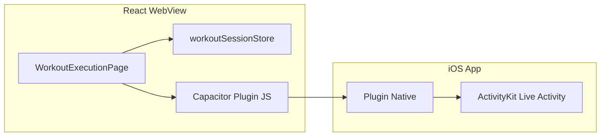

# Workout Timer, Background Accuracy & Dynamic Island / Lock Screen

## Goal

1. **Session and duration timers** keep accurate time when the app is backgrounded or the WebView is suspended (iOS WKWebView throttles `setInterval`).
2. **Optional (native):** Show a **Live Activity** / lock screen–style tile (similar to Google Maps navigation) with workout timer, current exercise, and weight — including **Dynamic Island** on supported devices.

The React web app runs inside Capacitor; **lock screen UI requires native iOS code** (ActivityKit), not CSS or React alone.

---

## Current State

| Component | Behavior | Problem |
|-----------|----------|---------|
| **Session elapsed** | [workoutSessionStore.ts](../packages/web/src/stores/workoutSessionStore.ts) — `startedAt`, `elapsedSeconds`, `tickElapsed` via `setInterval` in [WorkoutExecutionPage.tsx](../packages/web/src/features/workoutExecution/WorkoutExecutionPage.tsx) | Timers stall in background; elapsed drifts behind wall clock |
| **Pause** | `isPaused` + `pauseSession` / `resumeSession` | Need wall-clock math to exclude paused intervals |
| **Duration exercise timer** | Local React state `durationElapsed`, `durationRunning` in `WorkoutExecutionPage` | Lost on remount; does not survive process kill |
| **Lock screen / Dynamic Island** | Not implemented | WebView cannot render on lock screen; requires ActivityKit + Widget Extension |

---

## Phase A — Web app (Capacitor WebView)

### A1. Wall-clock session elapsed

- Extend session store to track **paused time** accurately, e.g.:
  - Record `pausedAt` when user pauses; on resume, add `(now - pausedAt)` to **`totalPausedMs`**, or
  - Maintain explicit `lastSyncAt` and derive elapsed from `Date.now() - startedAt - totalPausedMs`.
- On **`document.visibilitychange`** (when `document.visibilityState === 'visible'`) and optionally **Capacitor `App` `appStateChange`**, call **`syncElapsedFromClock()`** to set `elapsedSeconds` from wall time.
- Keep `setInterval` for smooth UI updates, but treat sync as source of truth after backgrounding.

### A2. Persist duration timer state

- Move per-exercise **duration** progress (`elapsed` within the timed set) into **persisted** state (session store or `persist` slice) keyed by workout + exercise index, so returning to the screen does not reset the countdown.

### A3. Testing

- Background app 30–60s with timer running; foreground — session time matches wall clock within ~1s.
- Pause/resume — no double-counting of paused intervals.
- Duration mode — progress survives brief navigation if applicable.

---

## Phase B — Native iOS (Live Activity / Dynamic Island)

### Why native

- **ActivityKit** (Live Activities) updates the Lock Screen and Dynamic Island from a **native Swift** process.
- The Capacitor WebView cannot host this UI; it must be a **Widget Extension** + **app target** code, bridged to JS.

### High-level architecture

- **Start activity:** When workout execution starts (or user opts in), JS calls plugin → native starts Live Activity with initial state (title, timer end or start time, weight).
- **Update:** On exercise change, weight change, pause — plugin pushes updates (iOS 16.1+ ActivityKit update API).
- **End:** On complete/cancel — end activity.

### Engineering tasks (indicative)

1. Xcode: enable **Push Notifications** capability if using push-based Activity updates (optional; local updates often sufficient for MVP).
2. Add **Widget Extension** target; implement `ActivityConfiguration` (or legacy `ActivityAttributes` + `ContentState`).
3. Implement **Capacitor plugin** (custom or community) exposing `startWorkoutActivity`, `updateWorkoutActivity`, `endWorkoutActivity`.
4. Map JS payload: `{ exerciseName, durationSeconds?, remainingSeconds?, weight?, weightUnit?, isPaused }` to `ContentState`.
5. Minimum iOS version: **16.1+** for Live Activities; Dynamic Island for iPhone 14 Pro+ models.

### Risks / constraints

- App Store review guidelines for Live Activities (timely, relevant, user-initiated).
- Battery and update frequency limits.
- **Out of scope for pure frontend:** Phase B requires Swift, Xcode, and CI changes for the iOS target.

---

## Implementation Checklist

### Phase A (frontend / Capacitor JS)

- [ ] Session store: pause accounting + `syncElapsedFromClock` on visibility / app resume
- [ ] `WorkoutExecutionPage`: wire `visibilitychange` / Capacitor app state to sync
- [ ] Persist duration timer state for current exercise in session store
- [ ] Manual QA on iOS Simulator and device

### Phase B (native)

- [ ] Spike: ActivityKit + static Live Activity from Xcode
- [ ] Capacitor plugin contract for start/update/end
- [ ] Wire plugin from `WorkoutExecutionPage` lifecycle
- [ ] Test Lock Screen + Dynamic Island on device

---

## Files (Phase A — likely)

| File | Role |
|------|------|
| [packages/web/src/stores/workoutSessionStore.ts](../packages/web/src/stores/workoutSessionStore.ts) | Paused time, sync API, optional duration fields |
| [packages/web/src/features/workoutExecution/WorkoutExecutionPage.tsx](../packages/web/src/features/workoutExecution/WorkoutExecutionPage.tsx) | Listeners + duration state migration |
| [packages/web/src/main.tsx](../packages/web/src/main.tsx) or Capacitor hooks | Optional: `App.addListener` for resume |

---

## References

- [Capacitor iOS plan](./capacitor-ios-plan.md)
- [polishing-ios-specific.md](./polishing/polishing-ios-specific.md)
- Apple: ActivityKit, Live Activities, WidgetKit
