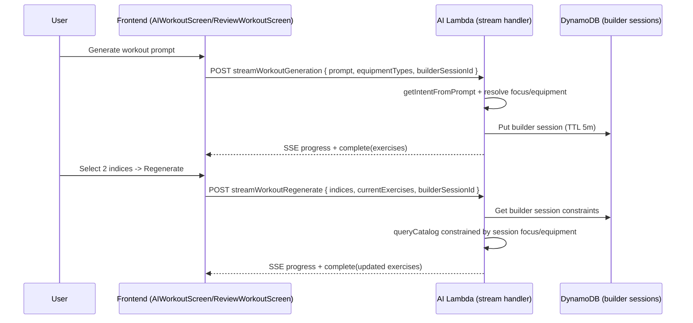

## Goal

Make AI workout generation + regenerate honor the user’s request (e.g. push day stays push; barbell-only stays barbell; regeneration stays within the original request constraints).

## Key root causes (from code)

- Candidate filtering for full flow is based on `getIntentFromPrompt()` muscle groups and `equipmentTypes` from the selected gym, but:
  - `focus` is extracted but not used to enforce strict muscle selection.
  - Equipment category strings from gyms (e.g. `free_weights`, `dumbbells`) are compared directly against catalog `equipment[]` values (e.g. `barbell`, `dumbbell`), which mismatches.
- Regeneration drifts because `runRegenerateFlow()`:
  - Filters catalog only by a single `muscleGroup` and **does not** reuse equipment constraints or the original user prompt.
  - The Bedrock regenerate prompt lacks the original request + constraints, so it can diverge even when the candidate set is imperfect.

## Implementation phases

### Phase 1: Tighten intent extraction + enforce focus/equipment constraints

1. **Update intent JSON schema** in `packages/lambdas/ai/src/flows.ts`:
  - Extend `getIntentFromPrompt()` output to include structured equipment intent (map “barbell/barbells” -> `free_weights`/barbell category) and keep focus.
  - Ensure the output is consistently parsed and defaults are safe.
2. **Enforce focus deterministically** in `runFullFlow()`:
  - When `intent.focus` is `push|pull|legs`, override `intent.muscleGroups` with the mapped muscle groups (e.g. push => `['chest','shoulders','triceps']`).
3. **Fix equipment filtering mismatch** between gym equipment categories and catalog equipment tokens:
  - Modify `packages/lambdas/shared/src/catalogQuery.ts` `filterByEquipment()` so it maps gym categories to the actual catalog `equipment[]` tokens.
  - Example mapping direction:
    - `dumbbells` => `['dumbbell']`
    - `free_weights` => `['barbell']`
    - `cables` => `['cable']`
    - `weight_rack` => bench/rack-ish tokens (derive by sampling catalog)
    - `cardio` => `['cardio']`
    - `machines` => `['machine']`
4. **Strengthen LLM prompts**:
  - In `selectExercises()` include explicit constraints derived from intent (focus + equipment category intent) in the prompt instructions.
  - In `pickReplacementExercises()` include the original request + constraints so replacements follow the same intent.

### Phase 2: Add a 5-minute DynamoDB “builder session” to preserve constraints across regenerate

1. **Create a new DynamoDB table** (TTL-enabled):
  - Add in CDK `packages/cdk/lib/tables.ts` a table (e.g. `repwise-workout-builder-sessions`) with:
    - `PK`: `USER#<userId>`
    - `SK`: `SESSION#<sessionId>` (or `BUILDER#<sessionId>`)
    - `expiresAt` (number) for TTL
    - stored fields: `originalPrompt`, `intentFocus`, `effectiveMuscleGroups`, `effectiveEquipmentCategories` (and/or mapped tokens), `createdAt`, and the current exerciseIds or last iteration metadata.
2. **Expose table name in shared**:
  - Update `packages/lambdas/shared/src/ddb.ts` and `ddb.d.ts` to export `BUILDER_SESSIONS_TABLE`.
  - Add shared helper(s) to `packages/lambdas/shared/src/ddb.ts` or a new module if preferred.
3. **Update AI lambda request/handler**:
  - In `packages/lambdas/ai/src/index.ts` and `packages/web/src/api/aiWorkoutStream.ts`, add `builderSessionId` to request bodies for both full generation and regenerate.
  - In `packages/lambdas/ai/src/flows.ts`:
    - On full flow: create the session item with TTL (5 minutes).
    - On regenerate: load session item and reuse constraints (focus, effective muscle groups, effective equipment categories) when calling `queryCatalog`.
4. **Update frontend draft/session wiring**:
  - Extend `packages/web/src/types/ui.ts` (`WorkoutDraft`) to include `builderSessionId?: string`.
  - In `packages/web/src/features/workoutBuilder/AIWorkoutScreen.tsx`:
    - create `const sessionId = crypto.randomUUID()` when the user hits generate;
    - pass it to `streamWorkoutGeneration` and store it in `setDraft({ ..., builderSessionId: sessionId })`.
  - In `packages/web/src/features/workoutBuilder/ReviewWorkoutScreen.tsx`:
    - when regenerating selected indices, include `builderSessionId` and keep using session-loaded constraints for candidate filtering.
5. **Regenerate correctness**:
  - Update `runRegenerateFlow()` signature so it can accept `sessionConstraints` (or at least equipment + effective muscle groups + original prompt).
  - Ensure replacements cannot introduce exercises outside the stored intent constraints.

### Phase 3: Admin screen to edit builder prompt templates + Bedrock model (no redeploy)

1. **Cognito admin group**:
  - In CDK `packages/cdk/lib/auth.ts`, add a User Pool Group (e.g. `builder-admin`).
2. **Admin-only API endpoints**:
  - Add one or more new lambdas in `packages/cdk/lib/repwise-stack.ts`:
    - GET builder AI config
    - PUT builder AI config (update templates + modelId)
  - Protect routes via the existing Cognito JWT authorizer AND enforce group membership inside the lambda by reading JWT claims.
3. **Store AI config** in DynamoDB:
  - Create a `repwise-workout-builder-config` table or reuse the builder-session table with a fixed PK (recommended: separate config table).
  - Store only what’s needed per request type:
    - intent extraction prompt template
    - full selection prompt template
    - regenerate prompt template
    - Bedrock `modelId` for both.
4. **Runtime usage in AI lambda**:
  - In `packages/lambdas/ai/src/flows.ts`, remove hard-coded `BEDROCK_MODEL` and prompt strings.
  - Fetch config from DynamoDB on each invocation (or cache per warm container) and use it when calling Bedrock.
5. **Frontend admin UI**:
  - Add a new route like `/admin/builder-ai`.
  - The page loads config from the new GET endpoint and allows editing + saving via PUT.
  - Hide the route unless backend returns admin permission.

## Verification checklist

- Scenario tests (repeat until passes):
  - Prompt: “push day” => generated exercises all within push muscles.
  - Prompt: “barbell only” => candidates are barbell-based (no dumbbells) when effective equipment is constrained.
  - Regenerate from a push-day builder session => replacements stay within original focus/equipment constraints.
- Regression checks:
  - Existing manual builder flow remains unchanged.
  - No hard dependency on sessionId for manual flows.
  - DynamoDB TTL items expire after ~5 minutes.
- Observability:
  - Log sessionId + resolved constraints (focus, equipment categories, muscle groups) in AI lambda.

## Suggested data flow (high level)

